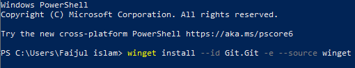
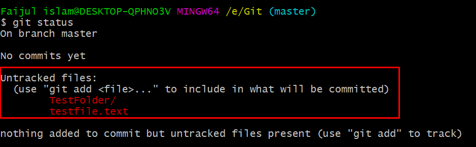

<h1 align="center">Git Cheat Sheet by Md Faijul Islam</h1>

## Table of Contents

1. **[Installing Git](#installing-git-based-on-your-operating-system)**
   - [Windows](#windows)
   - [Linux & Unix](#linux--unix)
   - [MacOS](#mac)
2. **[Git Profile Setup On Local Machine](#setting-up-git-user-profile-on-your-local-machine)**
3. **[Git Commands](#git-commands)**
   - [Git Initialize](#git-initialize)
   - [Git Track](#tracking-files-or-directory)
   - [Git Commit](#git-commit)

---

## Installing git based on your operating system

**The best place to get git based on your distribution is [git-scm.com](https://git-scm.com/downloads)**

### Windows

- On window we can install by downloading the git.exe file form the official webpage [Install Git For Windows](https://git-scm.com/downloads/win)

  

- You can also use _winget_ to install by command line in powershell.

  ```
    winget install --id Git.Git -e --source winget
  ```

  

### Linux & Unix

- You can follow the instructions and command line code depending on your linux & unix distribution form the official webpage [Install Git For Linux and Unix](https://git-scm.com/downloads/linux)

### Mac

- Mac is also a UNIX based platform. There are several options for installing Git on macOS. You can choose the right option for you form the official webpage [Install Git For MacOS](https://git-scm.com/downloads/mac)

After installation to lookup of your `git` is set up correctly then you can use the command `git --version` and verify it.


---

## Setting up git user profile on your local machine

You can setup you profile from the command line in order to associate your commits with your corresponding identity.
The following identity setup is build upon assuming you have a **`Github`** account.

The command that you will use are:

```
git config --global user.name "your Github User Name"
git config --global user.email "your Github Email"
```

After witch you can verify or check the list of users in your machine using the command

```
git config --global --list
```

You can edit them by using the following command. This will open the credentials on the default terminal editor like _`nano`_ or _`vim`_.

```
git config --global --edit
```

## Git Commands

### Git Initialize

To let git know which directory you want to track you have to initialize it on the directory using `git init` which will create the `.git` folder on the directory that holds all the git configurations as well as confirming that git has been initialized on that directory.


> _As a `.` file it may be hidden. So please make sure to enable show hidden files to view the file or write `ls -a` on the bash or terminal on that specific directory._

### Tracking Files or Directory

After you initialize a directory using _`git init`_ all the files and directories in that directory can be tracked by _`git`_.
Which we can easily verify by using the command

```
git status
```



There are two states of the contents in the git initialized directory.

1. **Untracked**
2. **Tracked**

#### Untracked Status

When ever a new file or directory is added to the git initialized directory they are in an untracked state by default. Meaning although git has located these files or directories their version histories are not tracked by git.
Which means that even if you do changes git won't remember them and you won't be able to go back to a previous state. Which beats one of the main reasons we use version control systems like git.


Other than tracked and untracted file another term you would often heard using _`git add`_ is _Staged_ & _Unstaged_.
But what are they?
Well this terms are only valid for tracked files. Until a tracked file is added using _`git add`_ after edit it's **_Unstaged_** after adding it will be called ***_Staged_**.

### Git Commit

After adding files to git doesn't mean that git keep a backup of it. For that you have to set markers to let git know lines of code